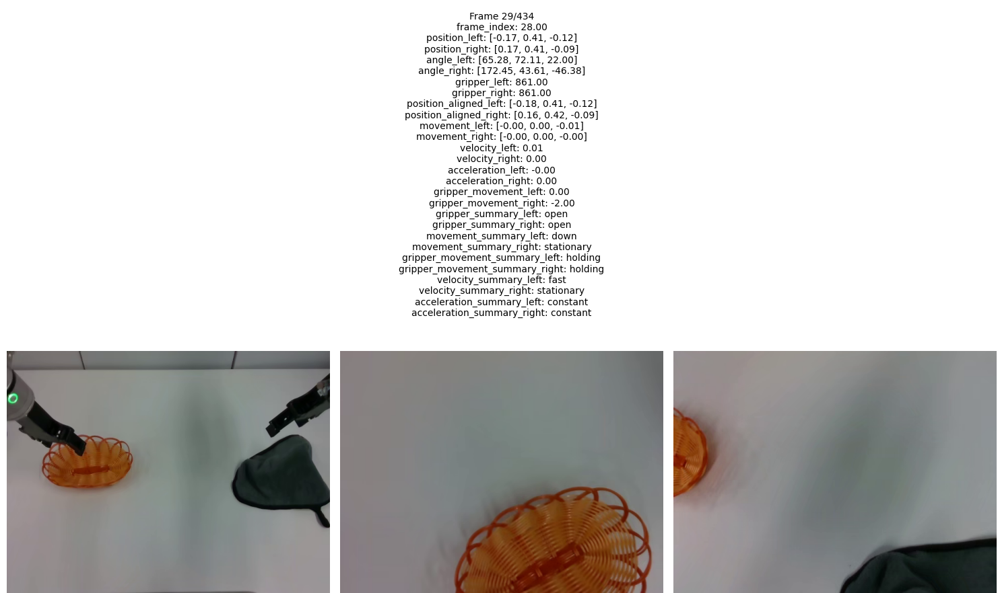

# Robotics Data Processor

## Converters

HDF5 -> LeRobot:

```bash
python scripts/hdf5_to_lerobot.py \
  --root path/of/your/hdfs/root \
  --repo_id your/lerobot/repo_id
```

Visualize LeRobot:

```bash
python scripts/visualize_lerobot.py --repo_id your/lerobot/repo_id
```

## Annotators

Annotate LeRobot:

1. Configure `repo_id` and `operators` in `scripts/annotate_lerobot.py`

2. Run script:

```bash
python scripts/annotate_lerobot.py
```

After running the script, `annotations/episode_xxxxxx.json` will be generated in your dataset root.

Each annotation file is like:
```json
[
    {
        "frame_index": 0,
        "position_left": [
            -0.16349099576473236,
            0.39679598808288574,
            -0.09831999987363815
        ],
        "position_right": [
            0.17527300119400024,
            0.41123101115226746,
            -0.09302199631929398
        ],
        "angle_left": [
            55.723604477244805,
            70.38922336513163,
            12.557138268278422
        ],
        "angle_right": [
            172.23462939423146,
            43.427183979105465,
            -46.74507331266031
        ],
        "gripper_left": 861.0,
        "gripper_right": 863.0,
        "position_aligned_left": [
            -0.17430658323901269,
            0.3921652418233396,
            -0.09831999987363815
        ],
        "position_aligned_right": [
            0.16393441714026605,
            0.41588108439522653,
            -0.09302199631929398
        ],
        "movement_left": [
            0.0,
            0.0,
            0.0
        ],
        "movement_right": [
            0.0,
            0.0,
            0.0
        ],
        "velocity_left": 0.0,
        "velocity_right": 0.0,
        "acceleration_left": 0.0,
        "acceleration_right": 0.0,
        "gripper_movement_left": 0.0,
        "gripper_movement_right": 0.0,
        "gripper_summary_left": "open",
        "gripper_summary_right": "open",
        "movement_summary_left": "stationary",
        "movement_summary_right": "stationary",
        "gripper_movement_summary_left": "holding",
        "gripper_movement_summary_right": "holding",
        "velocity_summary_left": "stationary",
        "velocity_summary_right": "stationary",
        "acceleration_summary_left": "constant",
        "acceleration_summary_right": "constant"
    },
    ...
]
```

Visualize annotation:

```bash
python scripts/visualize_annotation.py --repo_id your/lerobot/repo_id
```

This script will open a window like:



You can press left/right direction key to switch frame.